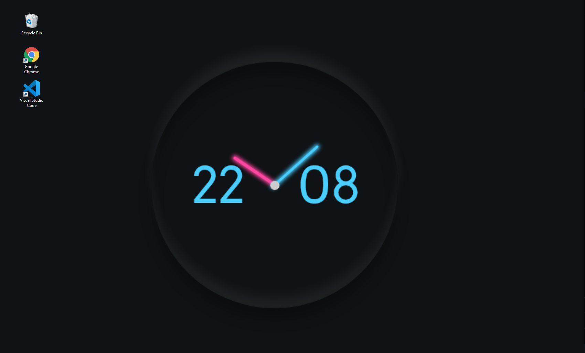

# wallpaper-clock

A live clock wallpaper using Node.js


## Get started

```
npm install
node index.js
```

## Run on startup with pm2

```
npm i -g pm2
pm2 startup
pm2 start index.js
pm2 save
```
